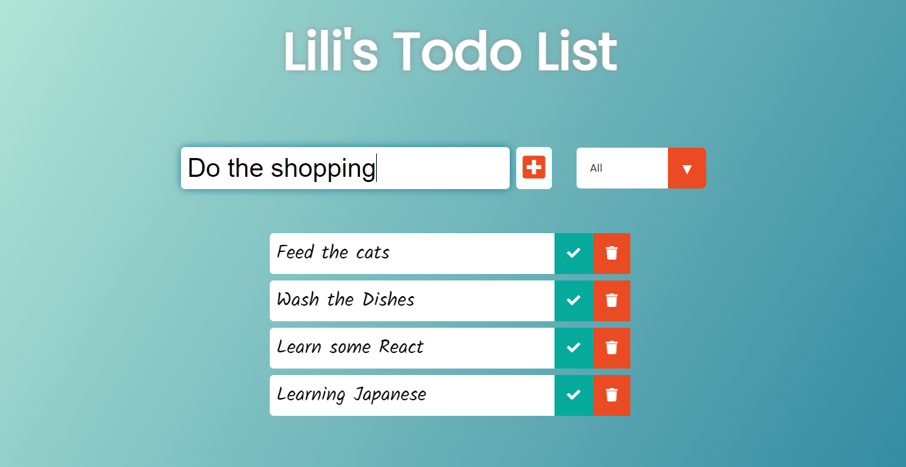
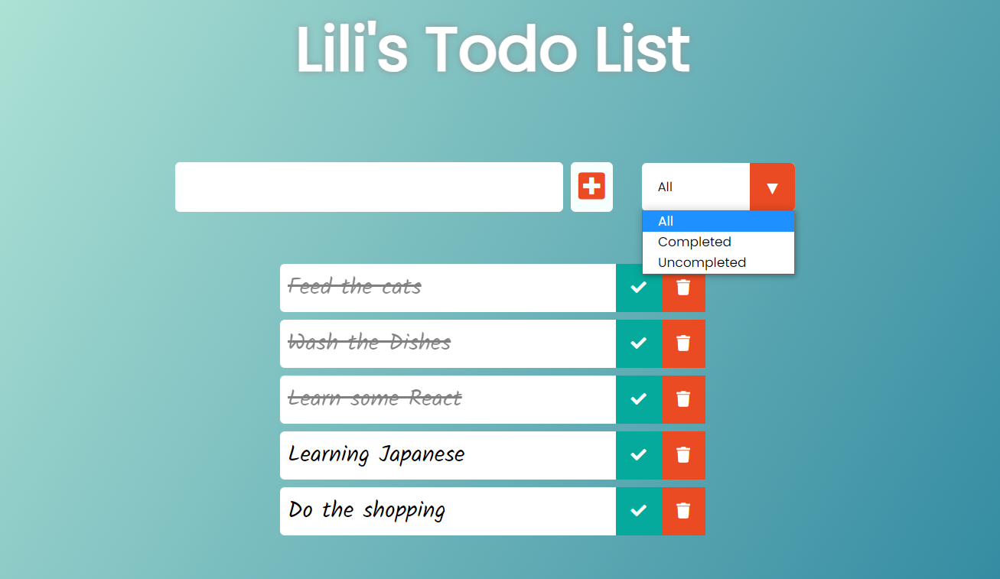
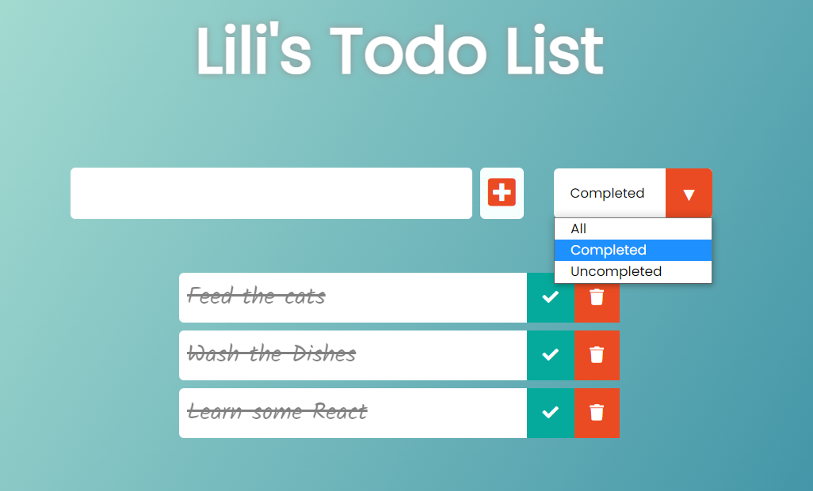

# Todo Application
This app was created with React.js and CSS. The purpose of creating this project was to get more familiar with the basics of React. While creating this app I learned how to use React Hooks in different components.

## Key Learning Objectives
React Hooks: to manage component states and side effects.
Render Props: to share the state or behavior that one component encapsulates to other components that need that same state.

## Snapshots from the app
The look of the Todo Application

The look of the select and the completed todos

Using the Completed select type

## Sources
This project was inspired by a React App tutorial by [developedbyed](https://github.com/developedbyed).